## Objective

Everyone has played badminton at least once in their lifetime. To play, we need to learn different shots and for that
we take help from coaches, tournament videos, books and last we do practice everyday.

But, after lots of practice, if you want to know that how perfect are your shots or what shot that international
player played in the video, how will you do that?

So, at that time, this application <b><code>Badminton Shot Recognition</code></b> can be used, which will provide realtime feedback by
recognizing your badminton shots.

## Dataset Breakdown

There are <code>17</code> different classes (badminton shots + background activity + no racket actions) on which this model is
trained using transfer learning on top of the weights provided by <code>sense</code> repository.

Number of total videos: 278 
Duration of videos: 4 to 5 seconds 
Dataset distribution: (approx) 70% train, 30% valid (Each class) 

<table>
    <tr>
        <th>Classes</th>
        <th>Train set</th>
        <th>Validation set</th>
    </tr>
    <tr>
        <td>with_racket</td>
        <td>11</td>
        <td>3</td>
    </tr>
    <tr>
        <td>without_racket</td>
        <td>14</td>
        <td>6</td>
    </tr>
    <tr>
        <td>no_person_visible</td>
        <td>12</td>
        <td>5</td>
    </tr>
    <tr>
        <td>getting_into_position</td>
        <td>11</td>
        <td>5</td>
    </tr>
    <tr>
        <td>forward_forehand_shot</td>
        <td>11</td>
        <td>5</td>
    </tr>    
    <tr>
        <td>forward_backhand_shot</td>
        <td>11</td>
        <td>5</td>
    </tr>    
    <tr>
        <td>forehand_underhead_shot</td>
        <td>11</td>
        <td>5</td>
    </tr>    
    <tr>
        <td>backhand_underhead_shot</td>
        <td>11</td>
        <td>5</td>
    </tr>    
    <tr>
        <td>forehand_overhead_shot</td>
        <td>11</td>
        <td>5</td>
    </tr>    
    <tr>
        <td>backhand_overhead_shot</td>
        <td>11</td>
        <td>5</td>
    </tr>    
    <tr>
        <td>forehand_side_shot</td>
        <td>12</td>
        <td>3</td>
    </tr>    
    <tr>
        <td>backhand_side_shot</td>
        <td>11</td>
        <td>5</td>
    </tr>    
    <tr>
        <td>forehand_backcourt_shot</td>
        <td>11</td>
        <td>5</td>
    </tr>    
    <tr>
        <td>backhand_backcourt_shot</td>
        <td>11</td>
        <td>5</td>
    </tr>
    <tr>
        <td>forehand_serve</td>
        <td>13</td>
        <td>5</td>
    </tr>
    <tr>
        <td>backhand_serve</td>
        <td>12</td>
        <td>5</td>
    </tr>
    <tr>
        <td>doing_nothing</td>
        <td>12</td>
        <td>5</td>
    </tr>
    <tr>
        <td>Total</td>
        <td>196</td>
        <td>82</td>
    </tr>
</table>

## Examples of classes
<table>
    <tr>
        <td>
            Forehand underhead shot 
            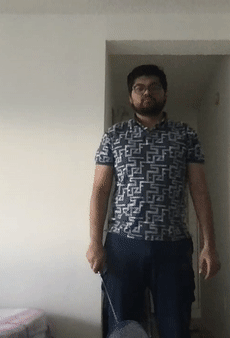
        </td>
        <td>
            Backhand underhead shot 
            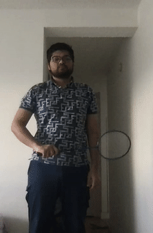
        </td>
        <td>
            Forward backhand shot 
            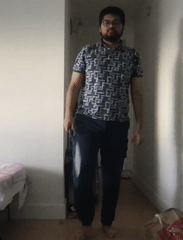
        </td>
        <td colspan="2">
            Forward forehand shot 
            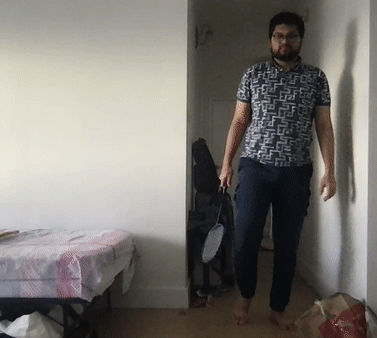
        </td>
    </tr>
    <tr>
        <td>
            Backhand backcourt shot 
            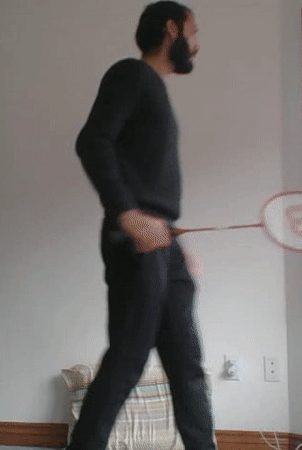
        </td>
        <td>
            Forehand backcourt shot 
            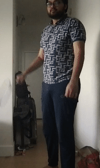
        </td>
        <td>
            Forehand serve 
            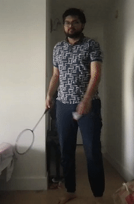
        </td>
        <td>
            Backhand serve 
            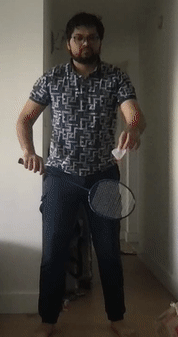
        </td>
        <td>
            Backhand side shot 
            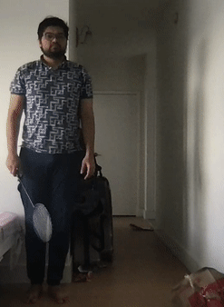
        </td>
    </tr>
    <tr>
        <td>
            Forehand side shot 
            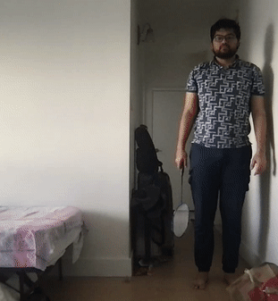
        </td>
        <td>
            Forehand overhead shot 
            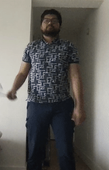
        </td>
        <td>
            Backhand overhead shot 
            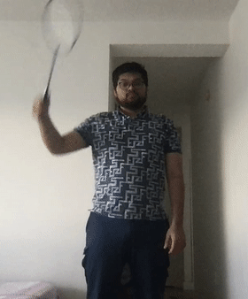
        </td>
        <td>
            With racket 
            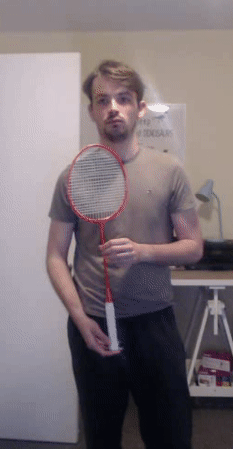
        </td>
        <td>
            Without racket 
            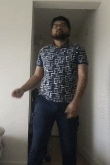
        </td>
    </tr>
</table>

## Output

    

